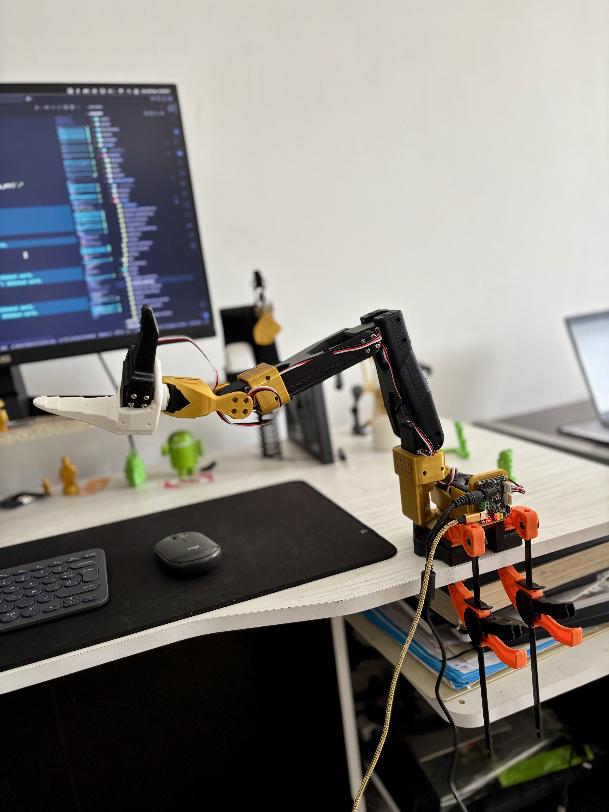

# RX Robo Rider Arm

El brazo robótico RX Robo Rider es una implementación personalizada del [SO-100](https://github.com/TheRobotStudio/SO-ARM100), con un elegante esquema de colores negro y dorado. Este proyecto documenta la configuración, montaje y operación del brazo robótico, con planes para futuras integraciones como cámaras y entrenamiento para detectar objetos a agarrar.



## Table of Contents

- [RX Robo Rider Arm](#rx-robo-rider-arm)
  - [Table of Contents](#table-of-contents)
  - [A. Source the parts](#a-source-the-parts)
  - [B. Install LeRobot](#b-install-lerobot)
      - [1. Instala Miniconda:](#1-instala-miniconda)
      - [2. Reinicia la terminal](#2-reinicia-la-terminal)
      - [3. Crea y activa un nuevo entorno conda para lerobot](#3-crea-y-activa-un-nuevo-entorno-conda-para-lerobot)
      - [4. Clona LeRobot:](#4-clona-lerobot)
      - [5. Instala ffmpeg en tu entorno:](#5-instala-ffmpeg-en-tu-entorno)
      - [6. Instala LeRobot con dependencias para los motores feetech:](#6-instala-lerobot-con-dependencias-para-los-motores-feetech)
  - [C. Configure the Motors](#c-configure-the-motors)
    - [1. Encuentra los puertos USB asociados a cada brazo](#1-encuentra-los-puertos-usb-asociados-a-cada-brazo)
    - [2. Configura los IDs de los motores](#2-configura-los-ids-de-los-motores)
  - [D. Step-by-Step Assembly Instructions](#d-step-by-step-assembly-instructions)
  - [E. Calibrate](#e-calibrate)
      - [Calibración manual del brazo seguidor](#calibración-manual-del-brazo-seguidor)
      - [Calibración manual del brazo líder](#calibración-manual-del-brazo-líder)
  - [F. Teleoperate](#f-teleoperate)
  - [G. Record a dataset](#g-record-a-dataset)
  - [H. Visualize a dataset](#h-visualize-a-dataset)
  - [I. Replay an episode](#i-replay-an-episode)
  - [J. Train a policy](#j-train-a-policy)
  - [K. Evaluate your policy](#k-evaluate-your-policy)
  - [L. More Information](#l-more-information)

## A. Source the parts

Para este proyecto, seguí la guía oficial de [SO-ARM100](https://github.com/TheRobotStudio/SO-ARM100). Este repositorio contiene la lista completa de materiales, enlaces para adquirir las piezas e instrucciones para imprimir en 3D los componentes necesarios.

Las piezas se imprimieron usando una impresora Creality Ender-3 V3 KE, y los archivos 3MF se encuentran en la carpeta [`STL`](./STL).


## B. Install LeRobot

En tu computadora:

#### 1. [Instala Miniconda](https://docs.anaconda.com/miniconda/install/#quick-command-line-install):

#### 2. Reinicia la terminal

Copia y pega en tu terminal: `source ~/.bashrc` o para Mac: `source ~/.bash_profile` o `source ~/.zshrc` si estás usando zshell

#### 3. Crea y activa un nuevo entorno conda para lerobot

```bash
conda create -y -n lerobot python=3.10
```

Luego activa tu entorno conda (¡haz esto cada vez que abras una terminal para usar lerobot!):

```bash
conda activate lerobot
```

#### 4. Clona LeRobot:

```bash
git clone https://github.com/huggingface/lerobot.git ~/lerobot
```

#### 5. Instala ffmpeg en tu entorno:

Cuando uses `miniconda`, instala `ffmpeg` en tu entorno:

```bash
conda install ffmpeg -c conda-forge
```

#### 6. Instala LeRobot con dependencias para los motores feetech:

```bash
cd ~/lerobot && pip install -e ".[feetech]"
```

## C. Configure the Motors

He proporcionado scripts de configuración para diferentes sistemas operativos en la carpeta [`setup`](./setup):

- `configure_motor.sh` - Para Linux
- `configure_motor_mac.sh` - Para macOS
- `configure_motor.ps1` - Para Windows

### 1. Encuentra los puertos USB asociados a cada brazo

Para encontrar el puerto de cada adaptador de servicio bus, ejecuta el script de utilidad:

```bash
python lerobot/scripts/find_motors_bus_port.py
```

### 2. Configura los IDs de los motores

Una vez que tengas tus puertos, usa los scripts proporcionados en la carpeta `setup` para configurar los IDs de tus motores. Por ejemplo, en macOS:

```bash
./setup/configure_motor_mac.sh
```

Asegúrate de actualizar el puerto y el ID en el script según sea necesario para cada motor.


## D. Step-by-Step Assembly Instructions

Sigue las instrucciones detalladas de montaje disponibles en la [guía oficial de LeRobot](https://github.com/huggingface/lerobot). Los pasos básicos incluyen:

1. Limpieza de todas las piezas impresas en 3D
2. Montaje de la base
3. Montaje del brazo superior
4. Montaje del antebrazo
5. Montaje de la muñeca
6. Configuración del seguidor (follower)
7. Configuración del líder (leader)


## E. Calibrate

Para calibrar tu brazo robótico RX Robo Rider:

#### Calibración manual del brazo seguidor

```bash
python lerobot/scripts/control_robot.py \
  --robot.type=so100 \
  --robot.cameras='{}' \
  --control.type=calibrate \
  --control.arms='["main_follower"]'
```

#### Calibración manual del brazo líder

```bash
python lerobot/scripts/control_robot.py \
  --robot.type=so100 \
  --robot.cameras='{}' \
  --control.type=calibrate \
  --control.arms='["main_leader"]'
```

## F. Teleoperate

Para este proyecto, utilicé [Phospho](https://docs.phospho.ai/so-100/quickstart) para mover el robot con el teclado, lo que proporciona una interfaz intuitiva para controlar el brazo robótico.

También puedes usar la teleoperación estándar de LeRobot:

```bash
python lerobot/scripts/control_robot.py \
  --robot.type=so100 \
  --robot.cameras='{}' \
  --control.type=teleoperate
```


## G. Record a dataset

Para grabar un conjunto de datos:

```bash
python lerobot/scripts/control_robot.py \
  --robot.type=so100 \
  --control.type=record \
  --control.fps=30 \
  --control.single_task="Grasp an object and place it in the designated area." \
  --control.repo_id=${HF_USER}/rx_robo_rider_test \
  --control.tags='["rx_robo_rider","robotic_arm"]' \
  --control.warmup_time_s=5 \
  --control.episode_time_s=30 \
  --control.reset_time_s=30 \
  --control.num_episodes=2 \
  --control.push_to_hub=true
```

## H. Visualize a dataset

Para visualizar el conjunto de datos en línea:

```bash
echo ${HF_USER}/rx_robo_rider_test
```

Visita [https://huggingface.co/spaces/lerobot/visualize_dataset](https://huggingface.co/spaces/lerobot/visualize_dataset) e introduce el ID del repositorio.

## I. Replay an episode

Para reproducir un episodio grabado:

```bash
python lerobot/scripts/control_robot.py \
  --robot.type=so100 \
  --control.type=replay \
  --control.fps=30 \
  --control.repo_id=${HF_USER}/rx_robo_rider_test \
  --control.episode=0
```

## J. Train a policy

Para entrenar una política para controlar tu robot:

```bash
python lerobot/scripts/train.py \
  --dataset.repo_id=${HF_USER}/rx_robo_rider_test \
  --policy.type=act \
  --output_dir=outputs/train/act_rx_robo_rider_test \
  --job_name=act_rx_robo_rider_test \
  --policy.device=cuda \
  --wandb.enable=true
```

## K. Evaluate your policy

Para evaluar tu política entrenada:

```bash
python lerobot/scripts/control_robot.py \
  --robot.type=so100 \
  --control.type=record \
  --control.fps=30 \
  --control.single_task="Grasp an object and place it in the designated area." \
  --control.repo_id=${HF_USER}/eval_act_rx_robo_rider_test \
  --control.tags='["rx_robo_rider","evaluation"]' \
  --control.warmup_time_s=5 \
  --control.episode_time_s=30 \
  --control.reset_time_s=30 \
  --control.num_episodes=10 \
  --control.push_to_hub=true \
  --control.policy.path=outputs/train/act_rx_robo_rider_test/checkpoints/last/pretrained_model
```

## L. More Information

Este proyecto es una implementación inicial del brazo robótico RX Robo Rider. Próximas actualizaciones incluirán:

- Integración de cámaras para visión robótica
- Entrenamiento para detección de objetos a agarrar
- Mejoras en la interfaz de usuario
- Optimización del rendimiento

Para más información sobre el uso de LeRobot, consulta la [documentación oficial](https://github.com/huggingface/lerobot/blob/main/examples/7_get_started_with_real_robot.md#4-train-a-policy-on-your-data).


